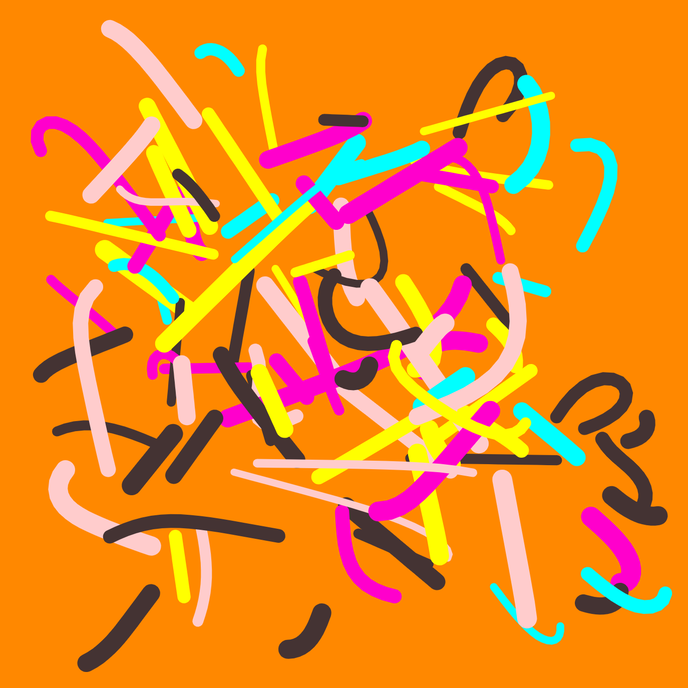

# fx(hash) x thi.ng project template



## About

This template repo provides a compact, ready-to-go scaffolding for generative
art projects aimed at the [fx(hash)](https://fxhash.xyz) NFT
platform/marketplace.

The template has served as basis for most of [the author's own NFT projects]()
and evolved over time. The template is aimed at
[TypeScript](https://www.typescriptlang.org/) (but can be easily adapted to
plain JavaScript) and uses [Vite](https://vitejs.dev/) as dev & build tool,
providing an altogether great & speedy workflow with minimal fuzz.

In the future I'm aiming to provide an alternative version for more advanced
uses aimed at hybrid projects using TypeScript, [Zig](https://ziglang.org) and
[WebAssembly](https://webassembly.org/)...

### Framework agnostic

Even though several packages from the [thi.ng/umbrella](https://thi.ng/umbrella)
eco system are used to provide various essential overarching functionality, the
template is organized in such a way that the main parts are completely framework
agnostic. You should be able to easily plug-in your own toolkit of choice,
however I cannot guarantee to be able to provide support for this myself (though
happy to accept PRs, also in terms of further docs, how-tos, guides etc.)

### Example project

A tiny, fully documented throwaway example sketch is included, illustrating the
following:

- overall project structure & build commands
- fxhash related setup
- static & dynamic configuration and state (re)initialization/handling
- fxhash PRNG wrapper & utilities
- canvas & SVG conversion/export/download
- 2D geometry creation, transformation & drawing
- basic vector algebra example usage

The best way is to dive into the source code and start reading the various
detailed comments...

### thi.ng/umbrella packages used

Note: Most of these package each have a much wider remit than used here in this small demo project scaffolding... 

Depending on which parts of the template you'll be keeping for your own purposes,
some of these packages can be safely removed. Feel free though to check out some
of the other 165+ packages in the [thi.ng/umbrella](https://thi.ng/umbrella)
monorepo...

| Package                                               | Role in this template                         |
|-------------------------------------------------------|-----------------------------------------------|
| [@thi.ng/adapt-dpi](https://thi.ng/adapt-dpi)         | Configure canvas for HDPI displays            |
| [@thi.ng/api](https://thi.ng/api)                     | Useful common & shared type definitions       |
| [@thi.ng/date](https://thi.ng/date)                   | Timestamp formatter for media downloads       |
| [@thi.ng/dl-asset](https://thi.ng/dl-asset)           | Canvas & SVG export/download                  |
| [@thi.ng/expose](https://thi.ng/expose)               | Conditionally expose vars during dev only     |
| [@thi.ng/geom](https://thi.ng/geom)                   | 2D geometry swiss army knife & SVG conversion |
| [@thi.ng/hiccup-canvas](https://thi.ng/hiccup-canvas) | 2D canvas shape drawing                       |
| [@thi.ng/pixel](https://thi.ng/pixel)                 | Canvas & context creation                     |
| [@thi.ng/random-fxhash](https://thi.ng/random-fxhash) | fxhash PRNG wrapper & utils                   |
| [@thi.ng/resolve-map](https://thi.ng/resolve-map)     | Graphbased config & state initialization      |
| [@thi.ng/transducers](https://thi.ng/transducers)     | Iteration & data transformation               |
| [@thi.ng/vectors](https://thi.ng/vectors)             | nD Vector algebra                             |


## Getting started

Please consult the [GitHub
documentation](https://docs.github.com/en/repositories/creating-and-managing-repositories/creating-a-repository-from-a-template)
for how to clone this template repo. Once you got it on your local machine do
the following:

```bash
cd <path-where-you-cloned-this-tpl>

# download all dependencies (can also use npm)
yarn install

# start dev server & open in browser
yarn start
```

## Building for production

[Vite](https://vitejs.dev/) (the build tool used here) wraps
[Rollup](https://rollupjs.org/) to bundle all sources & referenced assets for
production. Furthermore, all unused code will be removed and the template is
configured to also minify the HTML wrapper and CSS stylesheets.

```bash
# create production build
yarn build

# same as build, but also creates a ZIP file for FXHash upload
# ZIP file will be placed in /dist subdir
yarn bundle

# preview production build (for local testing)
yarn preview
```

Please consult the Vite docs for further information and configuration
options...

**IMPORTANT NOTE:** Due to
[fxhash-website#246](https://github.com/fxhash/fxhash-website/issues/246) the
FXhash sandbox currently doesn't properly deal with ESM module scripts and
cannot preview your project. However, the generated ZIP can be tested via the
initial stage of the [Mint Generative
Token](https://www.fxhash.xyz/mint-generative) wizard on the FXhash website...

## Support / feedback

If you find this template useful and would like to financially support my open
source work, please consider a small donation via
[GitHub](https://github.com/sponsors/postspectacular),
[Patreon](https://www.patreon.com/thing_umbrella),
[Tezos](https://tzkt.io/tz1d4ThofujwwaWvxDQHF7VyJfaeR2ay3jhf) or, last but not
least, via [your next fx(hash)
mint](https://www.fxhash.xyz/doc/artist/pricing-your-project#splitting-the-proceeds)...

🙏😍

## License

This project is licensed under the MIT License. See LICENSE.txt

&copy; 2022 Karsten Schmidt