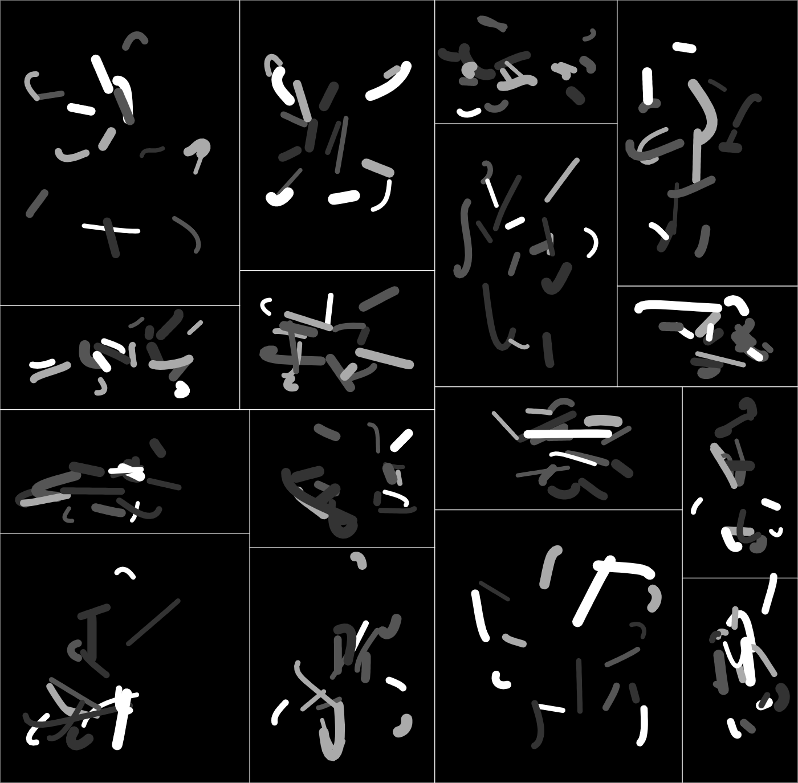

# fx(hash) x thi.ng project template



## About

This template repo provides a compact, ready-to-go scaffolding for generative
art projects aimed at the [fx(hash)](https://fxhash.xyz) NFT
platform/marketplace.

The template evolved over time and has served as basis for some of [the author's
own NFT projects](https://www.fxhash.xyz/u/toxi). The template is aimed at
[TypeScript](https://www.typescriptlang.org/) (but can be easily adapted to
plain JavaScript) and uses [Vite](https://vitejs.dev/) as dev & build tool,
ensuring an altogether great & speedy workflow with minimal fuzz.

(In the future, I'm aiming to provide an alternative version for more advanced
hybrid projects using TypeScript, [Zig](https://ziglang.org) and
[WebAssembly](https://webassembly.org/)...)

**The template is currently using the following version of the fxhash project sdk:** [61ac228c](https://github.com/fxhash/fxhash-package/commit/61ac228ce103fcea2e28c365f0facd38f0b8479f)

### Framework agnostic

Even though several packages from the [thi.ng/umbrella](https://thi.ng/umbrella)
ecosystem are used to provide various essential overarching functionality, the
template is organized in such a way that the main parts are completely
framework-agnostic. You should be able to easily plug in your own toolkit of
choice, however I cannot guarantee to be able to provide support for this myself
(though happy to accept PRs, also in terms of further docs, how-tos, guides
etc.)

### Example project

A tiny, fully documented throwaway example sketch is included, illustrating the
following:

-   Overall project structure & build commands
-   FXhash related setup
-   Static & dynamic configuration and state (re)initialization/handling
-   FXhash PRNG wrapper & utilities
-   Canvas & SVG conversion/export/download
-   2D geometry creation, transformation & drawing
-   Basic vector algebra example usage

The best way is to [dive into the source
code](https://github.com/thi-ng/tpl-umbrella-fxhash/blob/main/src/) and start
reading the various detailed comments to get a better overview of the broad
concepts used...

### thi.ng/umbrella packages used

Note: Most of these packages list here each have a much wider remit than
utilized here in this small demo project scaffolding...

Depending on which parts of the template you'll be keeping for your own
purposes, some of these packages can be safely removed. Feel free though to
check out some of the other 165+ projects in the
[thi.ng/umbrella](https://thi.ng/umbrella) monorepo (**NOT a framework!**)...

| Package                                               | Role in this template                         |
| ----------------------------------------------------- | --------------------------------------------- |
| [@thi.ng/adapt-dpi](https://thi.ng/adapt-dpi)         | Configure canvas for HDPI displays            |
| [@thi.ng/api](https://thi.ng/api)                     | Useful common & shared type definitions       |
| [@thi.ng/date](https://thi.ng/date)                   | Timestamp formatter for media downloads       |
| [@thi.ng/dl-asset](https://thi.ng/dl-asset)           | Canvas & SVG export/download                  |
| [@thi.ng/expose](https://thi.ng/expose)               | Conditionally expose vars during dev only     |
| [@thi.ng/geom](https://thi.ng/geom)                   | 2D geometry swiss army knife & SVG conversion |
| [@thi.ng/hiccup-canvas](https://thi.ng/hiccup-canvas) | 2D canvas shape drawing                       |
| [@thi.ng/pixel](https://thi.ng/pixel)                 | Canvas & context creation                     |
| [@thi.ng/random-fxhash](https://thi.ng/random-fxhash) | fxhash PRNG wrapper & utils                   |
| [@thi.ng/resolve-map](https://thi.ng/resolve-map)     | Graphbased config & state initialization      |
| [@thi.ng/transducers](https://thi.ng/transducers)     | Iteration & data transformation               |
| [@thi.ng/vectors](https://thi.ng/vectors)             | nD Vector algebra                             |

## Getting started

Please consult the [GitHub
documentation](https://docs.github.com/en/repositories/creating-and-managing-repositories/creating-a-repository-from-a-template)
for how to get started with template repos. Once you got it cloned locally, proceed as follows:

```bash
# git clone ...

cd <path-where-you-cloned-this-tpl>

# download all dependencies (can also use npm)
yarn install

# start dev server & open in browser
yarn start
```

## Building for production

[Vite](https://vitejs.dev/) (the build tool used here) wraps
[Rollup](https://rollupjs.org/) to bundle all sources & referenced assets for
production. Furthermore, all unused code will be removed and the template is
configured to also minify the included HTML wrapper and CSS stylesheets.

```bash
# create production build
yarn build

# same as build, but also creates a ZIP file for FXHash upload
# ZIP file will be placed in /dist subdir
yarn bundle

# preview production build (for local testing)
yarn preview
```

Please consult the [Vite docs](https://vitejs.dev/guide/) for further
information and configuration options...

## Support / feedback

If you find this template useful and would like to financially support my open
source work, please consider [taking part in the NFT
fundraiser](https://www.fxhash.xyz/generative/16330) or a small donation via
[GitHub](https://github.com/sponsors/postspectacular),
[Patreon](https://www.patreon.com/thing_umbrella),
[Tezos](https://tzkt.io/tz1d4ThofujwwaWvxDQHF7VyJfaeR2ay3jhf) or, last but not
least, via [your next fx(hash)
mint](https://www.fxhash.xyz/doc/artist/pricing-your-project#splitting-the-proceeds)...

🙏😍

## License

This project is licensed under the MIT License. See LICENSE.txt

&copy; 2022 Karsten Schmidt
